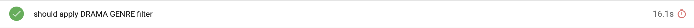
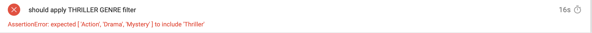
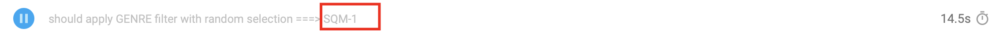

# Malwarebytes SDET Task

This project is a UI test framework for IMDb Top 250 Movies Chart functionalities in https://www.imdb.com/chart/top/?ref_=nv_mv_250_6. It is conducted as page object model in order to provide independency between test data and endpoints, to obtain cost effective maintanence and to adapt new test cases easily (central) of new features and functionalities.

## Prerequisites

1. Node.js https://nodejs.org/en/download
2. Check if Node.js and NPM are available in your system
```bash
  node -v
  npm -v
```
3. Java https://www.java.com/en/download/
4. Check if Java is installed successfuly in your system
```bash
  java -version
```
5. Docker https://docs.docker.com/get-docker/
6. Check if docker is installed successfuly in your system
```bash
  docker -v
```

## Installation

Go to your project directory

```bash
  cd your-project-folder
```

Clone the project

```bash
  git clone https://github.com/selenss/MB_QA_TASK.git
```

Install dependencies

```bash
  npm install
```

## Preconditions

In order to execute test cases, user credentials should be provided. 

```bash
  cd your-project-folder/cypress/params
```
In config.js file, add your autentication details (VALID_EMAIL, VALID_PASSWORD) for https://www.imdb.com/ 


## Running Tests Locally

To run tests in Chrome, run the following command

```bash
  npm "run test:chrome"
```

To run tests in Firefox, run the following command

```bash
  npm "run test:firefox"
```

To run tests in Electron, run the following command

```bash
  npm "run test:electron"
```

## Running Tests With Docker

Create the docker image, run the following command
```bash
  npm "docker build -t imdb-test-v1 ."
```
Create the Chrome container and execute the tests in Chrome Browser, run the following command
```bash
  npm "docker-compose run e2e-chrome"
```
Create the Firefox container and execute the tests in Chrome Browser, run the following command
```bash
  npm "docker-compose run e2e-firefox"
```
Create the Electron container and execute the tests in Chrome Browser, run the following command
```bash
  npm "docker-compose run e2e-electron"
```


## Test Report

To display test report with OS: Windows, run the following command

```bash
  npm "run test:report:win"
```
To display test report with OS: Linux/MacOS, run the following command

```bash
  npm "test:report"
```
If test case is passed
* 

If test case is failed
* 

If test case is skipped, title contains defect/bug ticket
* 

## Selected Tools
Cypress tool for automated tests is prefered due to its capabilities listed below;
* Inbuilt multiple browser support automatically detects installed browsers in your system
* Inbuilt Mocha support for grouping suites and tests
* Framework wide command usage without importing
* Inbuilt visual test execution (user friendly) feature and command line executions 
* Good and detailed online support 
* cy.wrap() method leads encapsulated and reusable test data

Mochawesome Reporter is used for visual test execution report with below abilities;
* Compatible with Cypress 
* Easy install and configuration

Javascript language is preferred;
* Human readibility is high
* Easy and fast package import 
* Non-complex and light-weighted project structure

## Project Structure
* Request groups : cypress/e2e/methods (If a new request group file is created, its path should be added to cypress/support/e2e.js so that it can be used anywhere in the framework)
* Test groups : cypress/e2e/tests
* Fixture test data : cypress/fixtures
* Test execution configuration : cypress/params/config.js
* Test framework configuration : cypress.config.js
* Constant test data: cypress/params/constants.js
* Utilities: cypress/support